# SetStats Entity Relationship Diagrams

This document contains entity relationship diagrams for the SetStats database schema using Mermaid syntax.

## Complete Entity Relationship Diagram

```mermaid
erDiagram
    User ||--o{ TrainingProgram : "creates"
    User ||--o{ TrainingCycle : "participates in"
    User ||--o{ WorkoutDay : "performs"
    User ||--o{ UserMax : "has"
    User ||--o{ UserInvitation : "receives"
    User }o--|| Role : "has"

    TrainingProgram ||--o{ TrainingProgramCycle : "links to"
    TrainingCycle ||--o{ TrainingProgramCycle : "implements"
    TrainingCycle ||--o{ WorkoutWeek : "contains"

    WorkoutWeek ||--o{ WorkoutDay : "schedules"

    WorkoutDay ||--o{ ProgrammedSet : "plans"

    ProgrammedSet ||--o| CompletedSet : "executed as"
    ProgrammedSet }o--|| ExerciseType : "uses"

    ExerciseType ||--o{ UserMax : "measured for"
    ExerciseType ||--o{ ProgressRecord : "tracked in"

    User ||--o{ ProgressRecord : "records"

    User {
        Guid Id PK
        string Email UK
        string UserName UK
        string PasswordHash
        string FirstName
        string LastName
        DateTime CreatedDate
        DateTime LastModifiedDate
        bool EmailConfirmed
        string PhoneNumber
        bool PhoneNumberConfirmed
        bool TwoFactorEnabled
        int AccessFailedCount
        bool LockoutEnabled
        DateTime LockoutEnd
    }

    Role {
        Guid Id PK
        string Name UK
        string NormalizedName
    }

    UserInvitation {
        Guid Id PK
        string InvitationCode UK
        string Email
        DateTime CreatedDate
        DateTime ExpirationDate
        bool IsUsed
        DateTime UsedDate
        Guid UsedByUserId FK
    }

    TrainingProgram {
        Guid Id PK
        Guid UserId FK
        string Name
        string Description
        string Goal
        bool IsActive
        DateTime CreatedAt
    }

    TrainingCycle {
        Guid Id PK
        Guid UserId FK
        int CycleNumber
        DateTime StartDate
        DateTime EndDate
        decimal RoundingFactor
        string Notes
    }

    TrainingProgramCycle {
        Guid Id PK
        Guid TrainingProgramId FK
        Guid TrainingCycleId FK
        DateTime LinkedDate
    }

    WorkoutWeek {
        Guid Id PK
        Guid TrainingCycleId FK
        int WeekNumber
        string WeekType
    }

    WorkoutDay {
        Guid Id PK
        Guid UserId FK
        Guid WorkoutWeekId FK
        DateTime WorkoutDate
        string Status
        string Notes
    }

    ExerciseType {
        Guid Id PK
        string Name UK
        string Category
        string Description
    }

    ProgrammedSet {
        Guid Id PK
        Guid WorkoutDayId FK
        Guid ExerciseTypeId FK
        decimal PercentageOfTrainingMax
        int TargetReps
        int SetOrder
        bool IsAMRAP
    }

    CompletedSet {
        Guid Id PK
        Guid ProgrammedSetId FK
        decimal ActualWeight
        int ActualReps
        int RateOfPerceivedExertion
        string Notes
    }

    UserMax {
        Guid Id PK
        Guid UserId FK
        Guid ExerciseTypeId FK
        decimal MaxWeight
        DateTime RecordedDate
        string Notes
    }

    ProgressRecord {
        Guid Id PK
        Guid UserId FK
        Guid ExerciseTypeId FK
        DateTime RecordDate
        decimal Weight
        int Reps
        decimal EstimatedOneRepMax
        string Notes
    }
```



## Core Workout Hierarchy

This diagram shows the hierarchical relationship of workout-related entities:


## User & Authentication Context

This diagram shows user-related entities including authentication and authorization:


## Exercise & Progress Tracking Context

This diagram focuses on exercise management and progress tracking:


## Data Flow: Programmed to Completed Workout

This diagram illustrates the data flow from planning to execution:


## Database Table Summary

### Identity Tables (ASP.NET Core Identity)

| Table | Description |
|-------|-------------|
| **users** | Core user accounts with extended properties (FirstName, LastName) |
| **roles** | User roles (Admin, User) |
| **user_roles** | Many-to-many relationship between users and roles |
| **user_claims** | Additional user claims/attributes |
| **user_logins** | External login providers (Google, Facebook, etc.) |
| **user_tokens** | Authentication tokens for users |
| **role_claims** | Claims associated with roles |

### Application Tables

| Table | Description |
|-------|-------------|
| **user_invitations** | Invitation codes for registration control |
| **training_programs** | Named training plans (e.g., StrongLifts 5x5) |
| **training_cycles** | Specific instances of training programs with dates |
| **training_program_cycles** | Links programs to cycles (many-to-many) |
| **workout_weeks** | Weeks within a training cycle (1-4) |
| **workout_days** | Individual workout sessions with date and status |
| **exercise_types** | Available exercises (Squat, Bench, Deadlift, etc.) |
| **programmed_sets** | Planned sets with target weight % and reps |
| **completed_sets** | Actual logged sets with weight, reps, and RPE |
| **user_maxes** | User's one-rep maxes for each exercise |
| **progress_records** | Historical progress data and E1RM calculations |

## Cardinality & Relationships

### One-to-Many Relationships

- **User → TrainingProgram**: One user creates many training programs
- **User → TrainingCycle**: One user participates in many training cycles
- **User → WorkoutDay**: One user performs many workout days
- **User → UserMax**: One user has many 1RM records
- **User → ProgressRecord**: One user has many progress records
- **TrainingCycle → WorkoutWeek**: One cycle contains many weeks (typically 4)
- **WorkoutWeek → WorkoutDay**: One week schedules many workout days (typically 3-4)
- **WorkoutDay → ProgrammedSet**: One workout day plans many sets
- **ProgrammedSet → CompletedSet**: One programmed set can be completed once (1:0..1)
- **ExerciseType → ProgrammedSet**: One exercise type appears in many programmed sets
- **ExerciseType → UserMax**: One exercise type has many user max records (historical)
- **ExerciseType → ProgressRecord**: One exercise type has many progress records

### Many-to-Many Relationships

- **TrainingProgram ↔ TrainingCycle**: Many programs can be implemented across many cycles (via TrainingProgramCycle junction table)

### Optional Relationships

- **CompletedSet → ProgrammedSet**: A programmed set may or may not be completed (0..1 relationship)
- **TrainingCycle.EndDate**: NULL if cycle is currently active

## Key Indexes (Recommended)

```sql
-- User lookups
CREATE INDEX idx_users_email ON users(email);
CREATE INDEX idx_users_username ON users(user_name);

-- Invitation lookups
CREATE UNIQUE INDEX idx_user_invitations_code ON user_invitations(invitation_code);
CREATE INDEX idx_user_invitations_email ON user_invitations(email);
CREATE INDEX idx_user_invitations_used ON user_invitations(is_used);

-- Workout queries
CREATE INDEX idx_workout_days_user_date ON workout_days(user_id, workout_date DESC);
CREATE INDEX idx_workout_days_week ON workout_days(workout_week_id);
CREATE INDEX idx_workout_days_status ON workout_days(status);

-- Set lookups
CREATE INDEX idx_programmed_sets_workout ON programmed_sets(workout_day_id);
CREATE INDEX idx_programmed_sets_exercise ON programmed_sets(exercise_type_id);
CREATE INDEX idx_completed_sets_programmed ON completed_sets(programmed_set_id);

-- Progress tracking
CREATE INDEX idx_progress_records_user_exercise ON progress_records(user_id, exercise_type_id, record_date DESC);
CREATE INDEX idx_user_maxes_user_exercise ON user_maxes(user_id, exercise_type_id);

-- Training cycle queries
CREATE INDEX idx_training_cycles_user ON training_cycles(user_id, start_date DESC);
CREATE INDEX idx_workout_weeks_cycle ON workout_weeks(training_cycle_id);
```

## Foreign Key Constraints

All foreign key relationships enforce referential integrity:

- **ON DELETE RESTRICT**: Used for most relationships to prevent accidental data loss
  - Cannot delete a User if they have TrainingCycles
  - Cannot delete an ExerciseType if it's used in ProgrammedSets

- **ON DELETE CASCADE**: Used selectively for dependent data
  - Deleting a WorkoutDay cascades to ProgrammedSets
  - Deleting a ProgrammedSet cascades to CompletedSet
  - Deleting a TrainingCycle cascades to WorkoutWeeks

## Enums (Stored as Strings in Database)

### WorkoutCategory (ExerciseType.Category)
- `Main` (0): Primary compound movements (Squat, Bench, Deadlift)
- `Assistance` (1): Accessory exercises (Curls, Rows, Extensions)

### WeekType (WorkoutWeek.WeekType)
- `Standard` (0): Normal training intensity
- `Deload` (1): Reduced intensity recovery week

### WorkoutDayStatus (WorkoutDay.Status)
- `Planned` (0): Workout is scheduled but not started
- `Completed` (1): Workout has been logged and completed
- `Skipped` (2): Workout was intentionally skipped (rest day, injury, etc.)

### CycleSequence (Future Use)
- `Intro` (0): Introduction/testing phase
- `Strength` (1): Main strength building phase
- `Deload` (2): Recovery phase

## Data Integrity Rules

1. **Invitation Codes**:
   - Must be unique
   - Cannot be reused after being marked as used
   - Must have expiration date after creation date

2. **Training Cycles**:
   - StartDate must be before EndDate (if EndDate is set)
   - CycleNumber must be positive
   - RoundingFactor typically 2.5, 5, or 10 lbs

3. **Workout Weeks**:
   - WeekNumber must be between 1-4
   - WeekNumber must be unique within a TrainingCycle

4. **ProgrammedSets**:
   - PercentageOfTrainingMax typically between 0.50 (50%) and 1.00 (100%)
   - TargetReps must be positive
   - SetOrder must be positive and unique within a WorkoutDay/ExerciseType

5. **CompletedSets**:
   - ActualWeight must be positive
   - ActualReps must be positive
   - RateOfPerceivedExertion must be between 1-10 (if provided)

6. **UserMax**:
   - MaxWeight must be positive
   - RecordedDate cannot be in the future

## Calculated Fields & Derived Data

### Estimated One-Rep Max (E1RM)
Calculated from CompletedSet data using Epley formula:
```
E1RM = ActualWeight × (1 + ActualReps / 30)
```

Alternative Brzycki formula:
```
E1RM = ActualWeight × (36 / (37 - ActualReps))
```

### Training Max (TM)
Typically 90% of 1RM:
```
TrainingMax = UserMax × 0.90
```

### Target Weight for Programmed Set
```
TargetWeight = TrainingMax × PercentageOfTrainingMax
RoundedWeight = ROUND(TargetWeight / RoundingFactor) × RoundingFactor
```

### Total Volume
```
Volume = SUM(ActualWeight × ActualReps) for all CompletedSets
```

### Tonnage (Alternative Volume Metric)
```
Tonnage = SUM(ActualWeight × ActualReps × NumberOfSets)
```

---

## Future Entity Considerations

### Potential Additional Entities

1. **UserSettings**
   - PreferredUnits (lbs/kg)
   - DefaultRestTime
   - DefaultRoundingFactor
   - AvailablePlates (JSON array)
   - AvailableBarbells (JSON array)

2. **WorkoutTemplate**
   - Reusable workout patterns
   - Can be applied to create WorkoutDay + ProgrammedSets

3. **RestTimer**
   - Store rest time preferences per exercise category
   - Track actual rest times during workouts

4. **ExerciseVideo/Image**
   - Media assets for exercise instructions
   - Linked to ExerciseType

5. **WorkoutNote**
   - Detailed notes attached to WorkoutDay
   - Separate from the simple notes field

6. **Deload Strategy**
   - Configuration for automatic deload week generation
   - Percentage reduction rules

7. **PlateConfiguration**
   - User's available equipment
   - Multiple barbells, plate sets
   - Home gym vs commercial gym profiles

8. **PersonalRecord**
   - Dedicated PR tracking separate from UserMax
   - Includes context (date, training cycle, notes)
   - Different PR types (heaviest single, most reps at weight, etc.)

---

## Notes

- All `Id` fields use `Guid` for primary keys
- All timestamps use UTC timezone (`DateTime.UtcNow`)
- Database uses snake_case naming convention (lowercase with underscores)
- Entity classes use PascalCase naming convention in C#
- ApplicationDbContext automatically converts between conventions
- Nullable reference types are enabled project-wide
- All navigation properties are marked as `required` where appropriate
