# SetStats User Flow Diagrams

This document contains user flow diagrams for the SetStats application using Mermaid syntax.

## 1. Registration & Authentication Flow

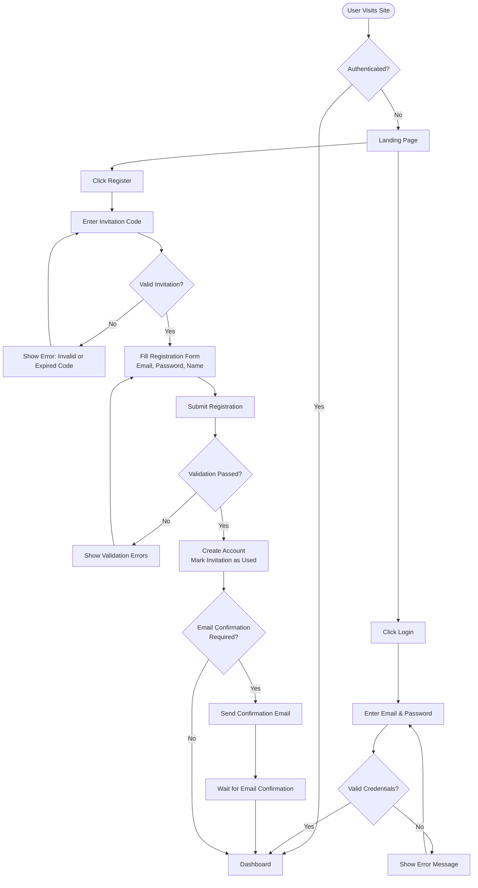

## 2. Admin - User Invitation Flow

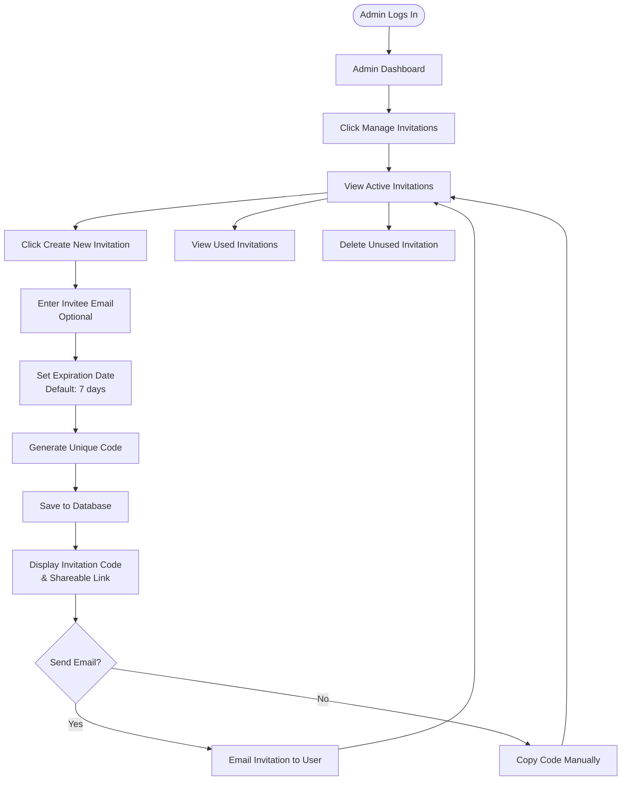

## 3. Exercise Management Flow

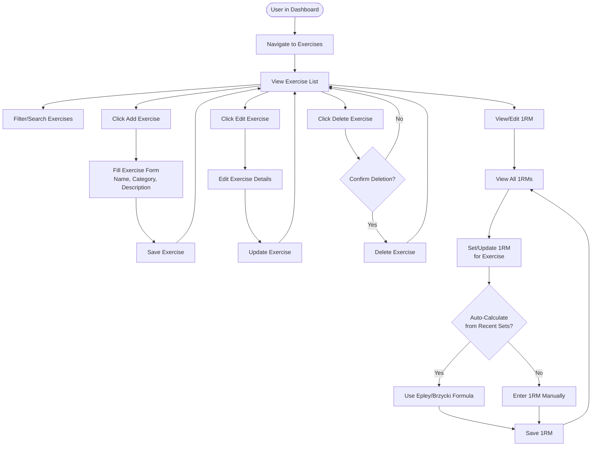

## 4. Training Program Setup Flow

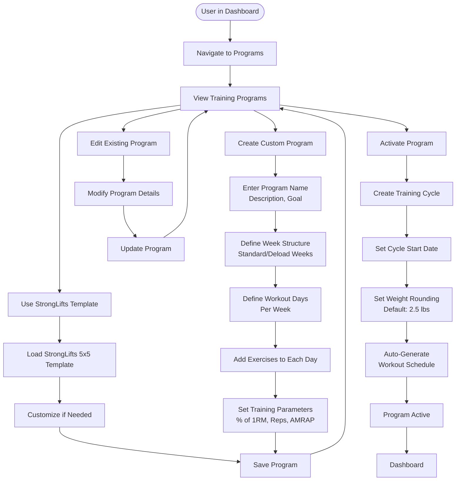

## 5. Active Workout Session Flow

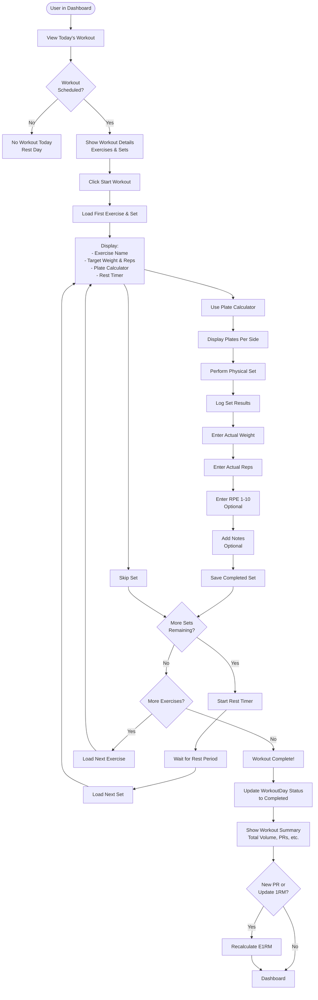

## 6. Progress Tracking & Reporting Flow

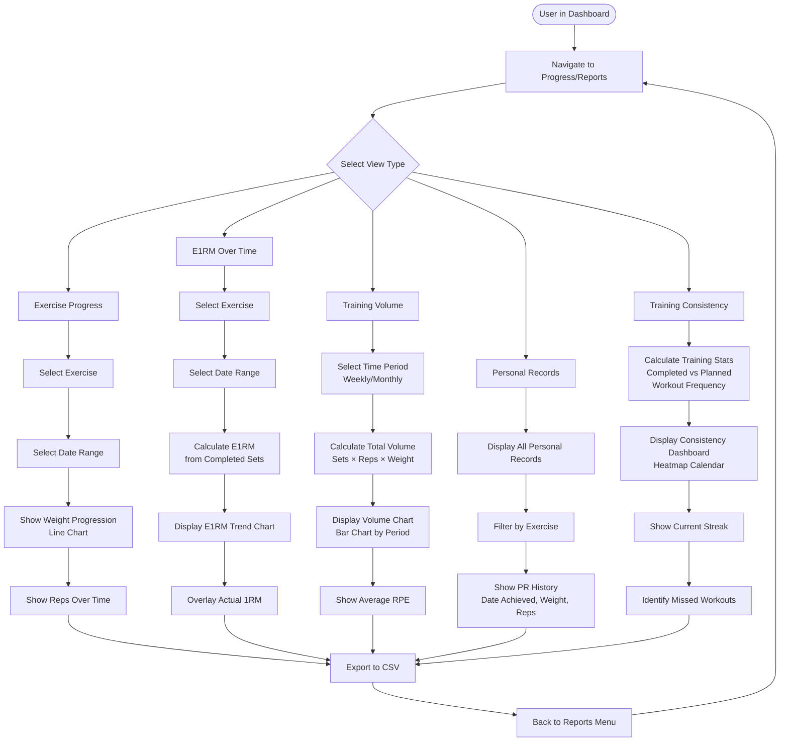

## 7. Plate Calculator Utility Flow

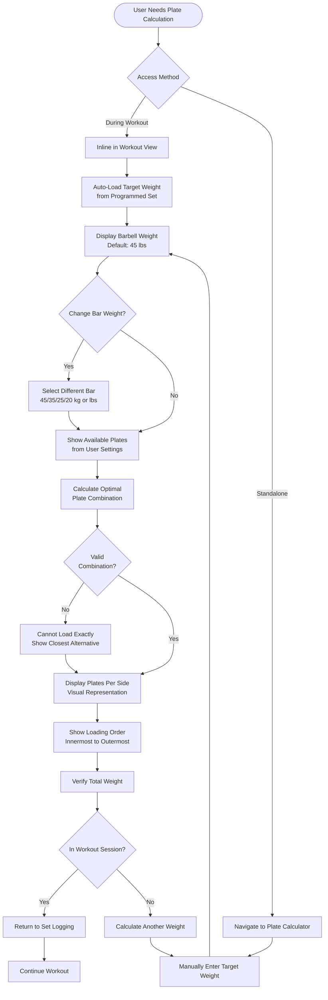

## 8. Workout History & Review Flow

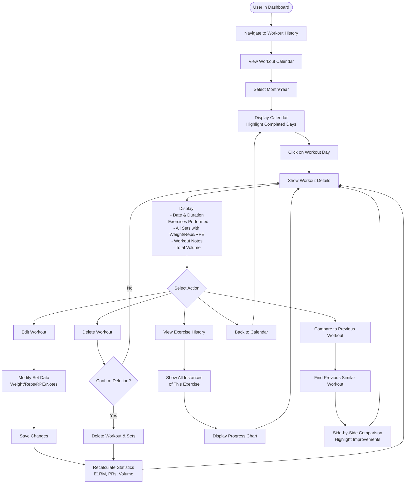

## 9. User Settings & Profile Flow

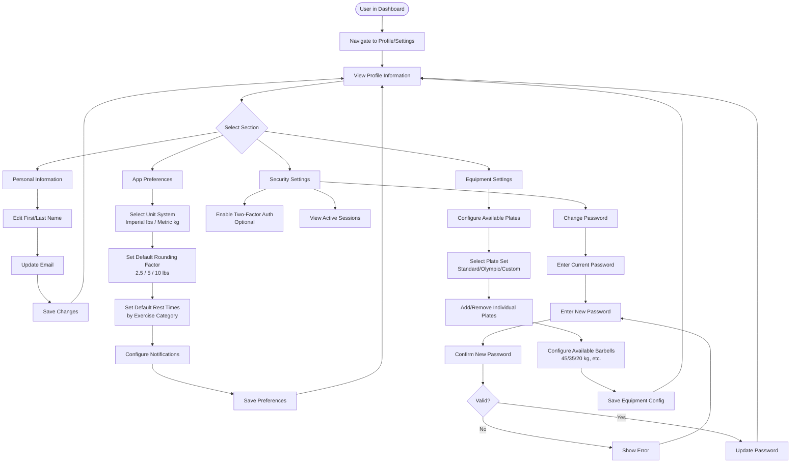

## 10. Admin Dashboard Flow

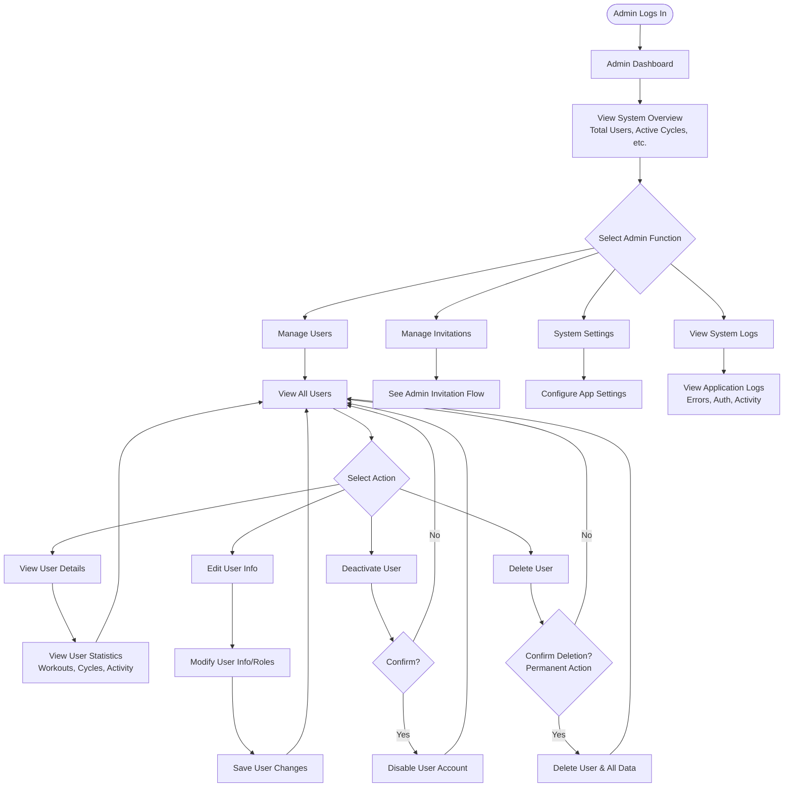

---

## Navigation Map

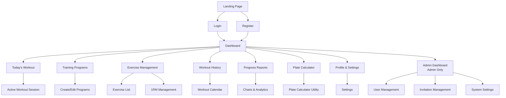

---

## Notes

- All diagrams use Mermaid syntax and can be rendered in GitHub, VS Code, or any Mermaid-compatible viewer
- Flows assume authenticated users unless otherwise specified
- Admin flows are restricted to users with Admin role
- Error handling and validation steps are included throughout
- Mobile-responsive design considerations should be applied to all flows
